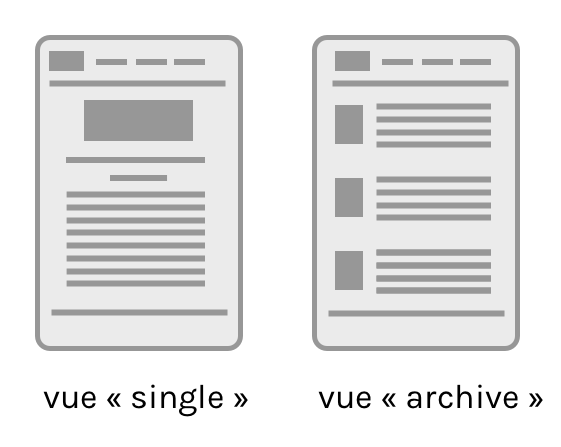
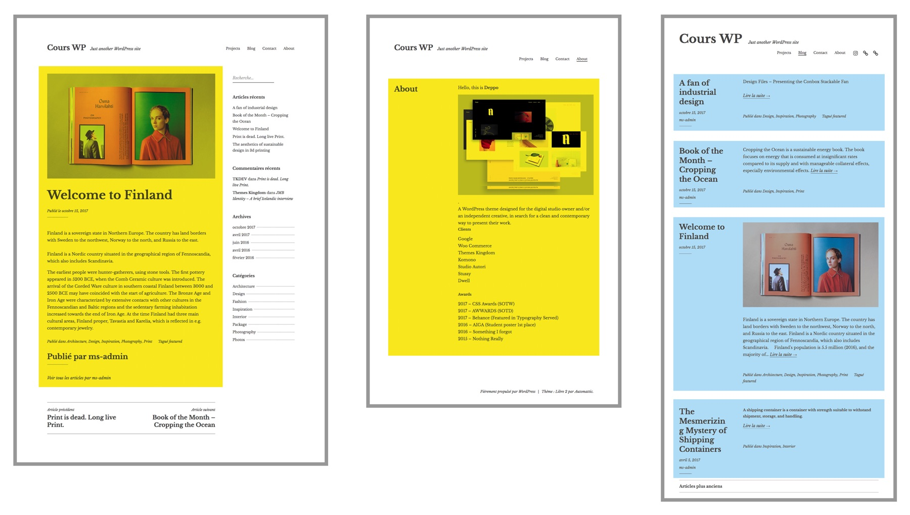
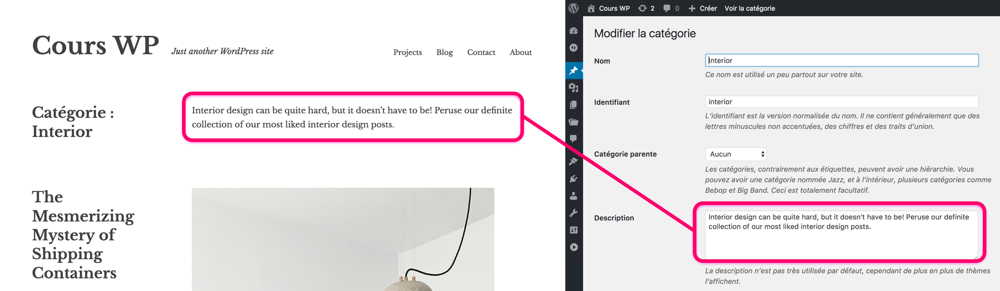
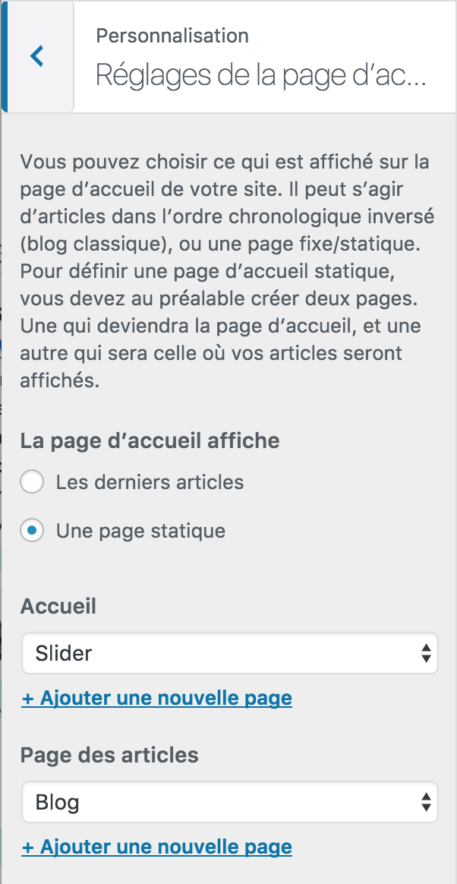
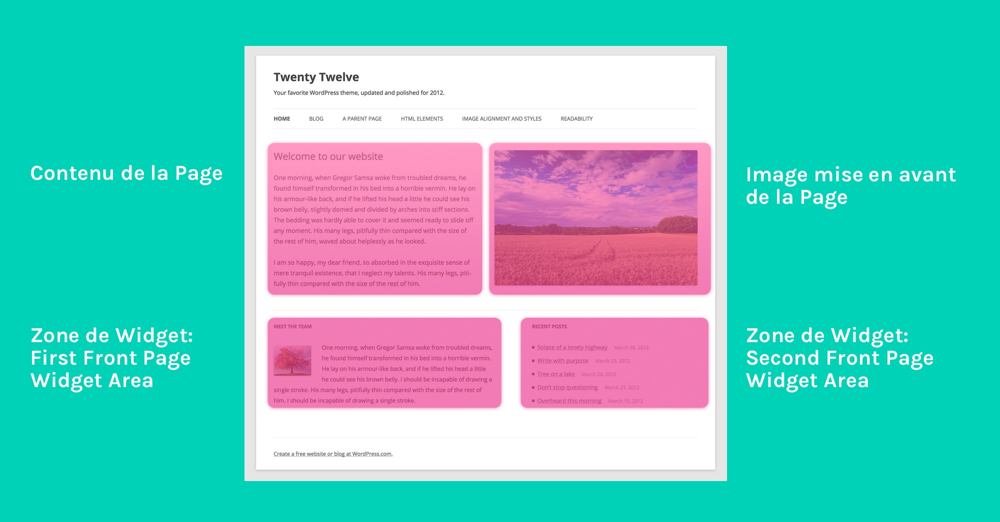
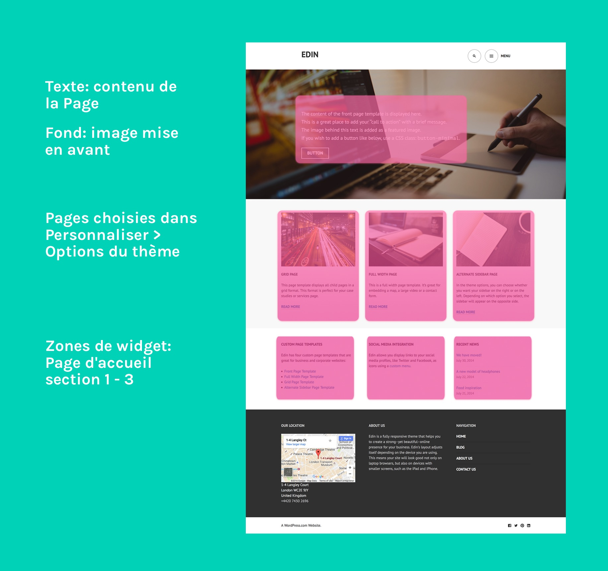

Comprendre la structure d'un site WordPress
---

On connaît à présent les différents types de contenus qui constituent un site WordPress, mais il n'est pas évident de comprendre comment les pages d'un site sont structurées.

Voilà une impression typique d'utilisateur débutant: 

> Je ne comprends pas comment les contenus se classent et quand/sous quels prétextes la hiérarchie intervient. Mes pages apparaissent aléatoirement, sans forcement de réel choix personnel. 

> Je ne savais pas ou se trouvaient mes articles, mes titres, mes projets..

Effectivement, WordPress va faire beaucoup de choses à votre place, et un grand nombre de choix de présentation sont imposés par le thème.

## Pages "single" et pages "archives"

Un concept important dans WordPress est la différence entre les pages affichant un **contenu unique** (single), et les pages affichant **une liste de contenus** (archives).

Voici les vues qui présentent un contenu unique:

- Vue d'un article
- Vue d'une page
- Vue d'un fichier attaché

Chaque Article et chaque Page possède son affichage unique, mais WordPress va également générer des vues affichant des **listes d’articles**.

Par défaut, la **page d'accueil** d’un site va montrer une liste d’articles récents. 

Il existe d’autres pages au format "liste d’articles", produites automatiquement par WordPress. Il s’agit notamment des pages montrant **les archives** triées par date (jour, mois, année), par Catégorie, par Étiquette (tag), ou par Auteur. 

Les pages d’archives par Catégorie, ou Étiquette, peuvent afficher une **description**, si celle-ci a été renseignée.

### Nombre d'éléments des pages archives

Le nombre d'éléments (articles) affichés sur les pages archives correspond à ce qui est configuré dans *Réglages -> Lecture*.

## Page d'accueil statique / page des articles

Comme on l'a vu, le comportement par défaut de la page d'accueil est de lister les plus récents articles.

Il est possible de changer ce réglage! Vous pouvez décider d'afficher sur la page d'accueil l'une de vos Pages... et si cette page utilise un Modèle de page spécifique, il sera utilisé pour la page d'accueil.

Ce réglage se trouve dans *Personnaliser > Réglages de la page d'accueil*.

Certains thèmes proposent des modèles spécialement conçus pour la page d'accueil, comportant différentes sections. Quelques exemples:

**TwentyTwelve** comporte un modèle de page "Front Page Template". Ce modèle possède deux *zones de widget* apparaissant uniquement sur ce template.

**[Edin](https://wordpress.com/theme/edin)** (créé par Thomas Guillot et Takashi Irie en 2014), comporte un modèle "Front Page". Ce modèle comporte de nombreuses options: il comporte trois zones de widgets spécifiques au modèle "Front Page", mais également trois vignettes permettant d'afficher un aperçu de trois pages. Celles-ci peuvent être sélectionnées dans *Personnaliser > Options du thème*.

Actuellement (fin 2017), WordPress n'a pas de méthode standardisée pour créer ce type de page modulaire. Il est donc nécessaire d'étudier le fonctionnement spécique du thème que vous utilisez.

### La page des articles

Si vous définissez une **Page d'accueil statique**, vous "perdez" du même coup la vue par défaut qui affichait les derniers articles...

Pour conserver cette vue, dans un autre endroit du site, vous pouvez définir la Page des articles.

### Les catégories comme outil de navigation

Imaginons que vous voulez créer des « pages » qui listent différents types d’articles par thématique, par exemple la photographie, la vidéo, le design graphique, etc. 

Le problème si vous utilisez des Pages, c'est qu'elles sont très statiques, et qu’il est difficile d’y placer un contenu particulier sous forme d’articles. Il existe une meilleure méthode, qui permet d’obtenir des « pages » contenant les articles voulus. 

Il faut commencer par créer des articles, par exemple, des articles sur la photographie. Il est ensuite possible de créer des catégories, et de les attribuer aux articles. 

Maintenant que chaque article possède une catégorie, il faut créer le menu des catégories. Pour cela, il faut se rendre sous l’onglet des menus, qui se trouve sous *Apparence*. 

Depuis là, il est possible d'ajouter à votre menu de navigation des Catégories, ou des Etiquettes. Il est donc possible avec peu d'effort d'obtenir une structure de navigation reposant sur les catégories. 
