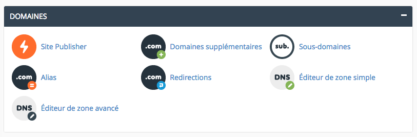
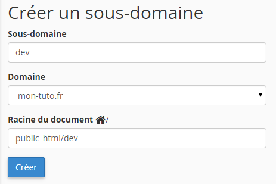
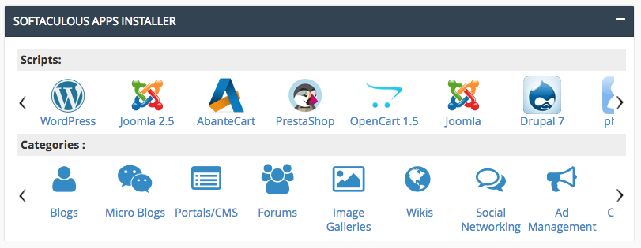

Ce document indique comment installer un site WordPress chez l'hébergeur [o2switch](http://www.o2switch.fr/). Chez d'autres hébergeurs, la procédure sera semblable. Nous utilisons l'installation "one-click" proposée par l'hébergeur.

1) Choix du nom de domaine. 
=== 

Votre site devra être accessible sous un nom de domaine. Vous avez deux possibilités: un **domaine** ou un **sous-domaine**.

Le premier cas sera celui d'un domaine - **example.com** - que vous aurez réservé auprès d'un Registrar (p.ex. [Infomaniak](https://www.infomaniak.ch/fr/domaines), [Gandi](https://www.gandi.net/domaine)...). 

Dans l'interface o2switch, vous devez vous rendre dans la partie concernant la gestion des noms de domaine ("Domaines supplémentaires"), pour y ajouter le vôtre.

Dans le deuxième cas, si vous optez pour un sous-domaine - du type **sousdomaine**.example.com - vous devez vous rendre sur l'écran concernant les "Sous-domaines". Vous pouvez ajouter un nouveau sous-domaine, en chosissant dans la liste le domaine parent.

2) Choix de la structure des dossiers
===

Durant cette procédure, l'hébergeur demande d'indiquer le dossier – "Racine du document" – dans lequel seront placés les fichiers du site. En effet, chaque site faisant partie de l'hébergement pointe vers un endroit spécifique dans la structure des dossiers.

Voici une structure possible, sachant qu'il s'agit d'un hébergement partagé par plusieurs utilisateurs pouvant avoir chacun plusieurs sites. Utilisez uniquement des caractères minuscules et sans accents.

`/sites/martine/mon-premier-site/web/`

Voici les quatre niveaux de dossiers utilisés dans cette configuration:

1. Nous rangeons tous les sites dans le dossier `sites` à la racine du répertoire.
2. Ensuite, chaque utilisateur a un dossier avec son prénom (p.ex. `martine`), qui contiendra ses projets.
3. Troisièmement, chaque site a son propre dossier (p.ex. `mon-premier-site`). Vous êtes libre de choisir son nom.
4. Finalement, la partie "visible sur Internet" du site est située dans le dossier nommé `web`. Cela permet d'avoir pour chaque site un espace "non accessible par le web", pour y placer des fichiers de configuration spécifiques au site. Par exemple, le fichier [`wp-config.php`](http://codex.wordpress.org/Hardening_WordPress#Securing_wp-config.php) pour un site WordPress.

3) Installation de WordPress
===

Nous pourrions maintenant suivre [la procédure classique d'installation de WordPress](http://codex.wordpress.org/fr:Installer_WordPress): télécharger le fichier ZIP de la dernière version de WordPress, le dézipper, le mettre en ligne par FTP, créer une base de données, parcourir les étapes de l'installeur de WordPress... 

Mais puisque notre hébergeur propose une interface (Softaculous) qui automatise toutes ces étapes, nous pouvons aller encore plus vite.

Rendez-vous dans la partie permettant d'installer des applications:

Cliquez l'icône de WordPress, puis cliquez "Installation" (ou *Install Now*).

Il vous faut à présent renseigner quelques champs:

- **Choisir le protocole:** laissez `http://`
- **Choisir un domaine:** sélectionnez dans la liste déroulante le domaine ou sous-domaine que vous avez préparé.
- **Répertoire** (par défaut: wp) : veillez à ce que **ce champ soit vide**, sinon WordPress sera installé dans un sous-répertoire du site, comme ceci: `example.com/wp`.
- Choisir **le nom du site**. Ce nom pourra être changé à tout moment. Il s'agit d'un champ pouvant contenir accents et charactères spéciaux. Même chose pour le champ Description du site.
- Choisir un **nom d'utilisateur**. Ça pourrait être votre prénom, mais évitez d'utiliser "admin". Attention, cet identifiant *ne pourra pas* être changé (même si vous pourrez ajouter de nouveaux utilisateurs à volonté).
- Choisir un **mot de passe**. Sachant que ce login sera certainement la cible de tentatives d'intrusion quotidiennes par des robots spammeurs, vous avez tout intérêt à chosir un mot de passe suffisamment long et unique pour résister à ces attaques.
- Entrez une **adresse email fonctionelle** - c'est important, car cette adresse sera utilisée si vous devez initialiser le mot de passe.

Cliquez sur **Installation** ... et voilà, votre site est prêt! Vous pouvez à présent vous connecter à l'espace d'administration et vous occuper des [réglages initiaux](reglages).

Si vous rencontrez des problèmes, la documentation d'O2switch offre des informations sur ces points:

* [Domaines supplémentaires](http://faq.o2switch.fr/hebergement-mutualise/tutoriels-cpanel/domaines-compagnons)
* [Sous domaines](http://faq.o2switch.fr/hebergement-mutualise/tutoriels-cpanel/sous-domaines)
* [Installation de WordPress](http://faq.o2switch.fr/hebergement-mutualise/tutoriels-cpanel/softaculous)

***