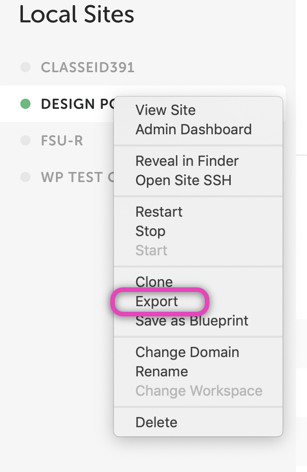
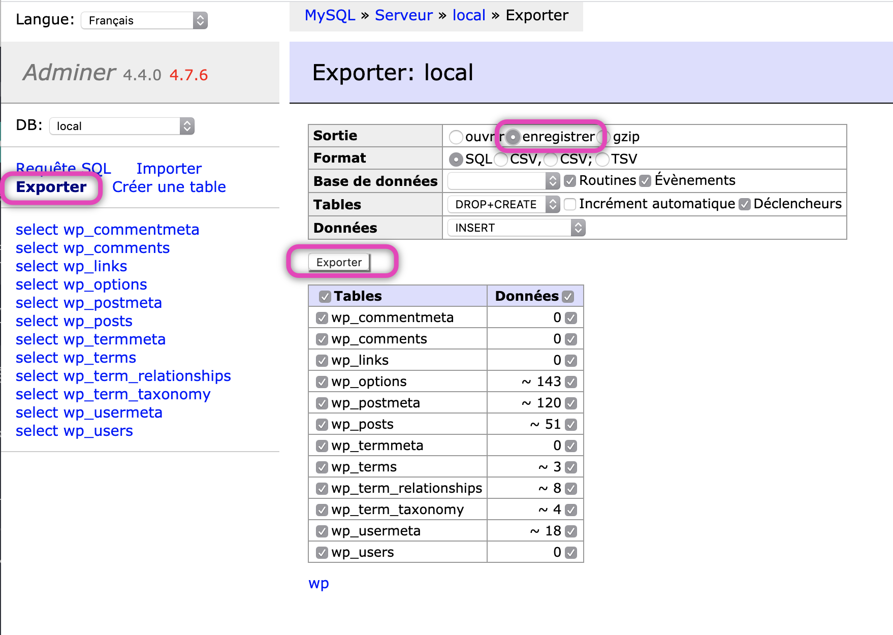
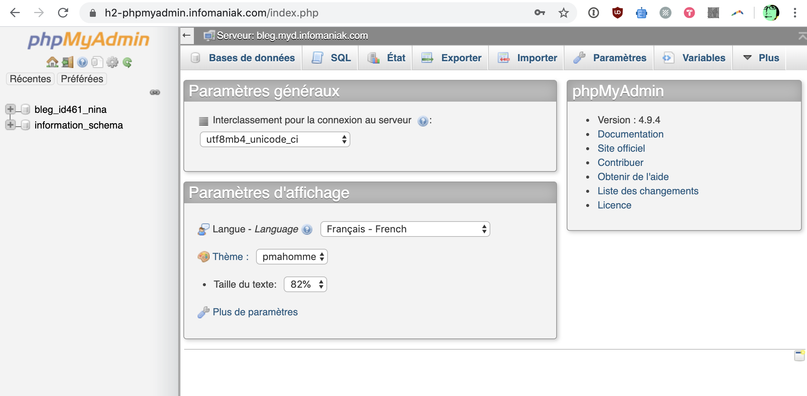
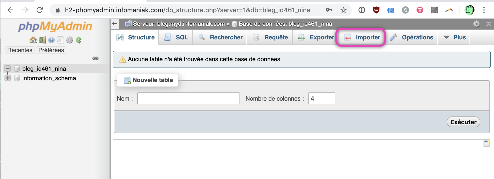

Mettre sur votre serveur web un site développé en local.

Vous devez avoir:
- Les fichiers statiques de votre site Local.
- Un export de la base de données de votre site Local.
- Les informations de connexion FTP du serveur web.
- Le login de la base de données MySQL.

Pour obtenir ces fichiers statiques:

- Exporter le site depuis Local. Cela va produire un .zip


 
- Dézipper le .zip, et aller dans le dossier "app"
- Vous avez un dossier "public" qui contient les fichiers statiques.
- Parmi ces fichiers, ouvrez le fichier wp-config.php avec un éditeur de code.

## Modification de wp-config.php

Vous allez devoir corriger les valeurs suivantes pour qu'elles correspondent au Login de base de données de votre serveur web.

Voici les quatre valeurs à modifier:

```
// ** MySQL settings ** //
/** The name of the database for WordPress */
define( 'DB_NAME', 'local' );

/** MySQL database username */
define( 'DB_USER', 'root' );

/** MySQL database password */
define( 'DB_PASSWORD', 'root' );

/** MySQL hostname */
define( 'DB_HOST', 'localhost' );
```

Dans la ligne `define( 'DB_NAME', 'local' );` vous remplacez "local" par le nom de votre base de données, qui pourrait ressembler à `bleg_id461_leo`.

Pour les deux lignes suivantes, vous remplacez "root" par votre utilisateur MySQL, puis par le mot de passe de cet utilisateur.

Finalement, le "localhost", selon votre configuration de serveur, pourra être différent. Par exemple chez Infomaniak, il est spécifique au compte utilisateur, et peut ressembler à: `bleg.myd.infomaniak.com`.

Une fois ces quatre données corrigées, enregistrez vos modifications.

## Mise en ligne par FTP

Vous pouvez maintenant mettre en ligne tous les fichiers (le contenu du dossier "public") en utilisant un logiciel FTP. Voir [Outils > FTP](https://cours-web.ch/outils/ftp/).

## Migrer la base de données

Vous avez maintenant besoin du fichier de votre base de données. Selon la version de Local que vous utilisez, vous pouvez appliquer une de ces méthodes:

- Aller dans le fichier exporté, dossier "app/sql", et vous trouverez un fichier "local.sql" (un fichier).
- Dans l'interface de Local, choisir "Database" > "Adminer". Dans cet outil d'administration, cliquer "Exporter", sélectionner "Sortie: Enregistrer", et encore une fois le bouton "Enregistrer"... cela produira également un fichier "local.sql".



Vous devez maintenant **importer** cette base de données sur votre serveur web. Vous devez vous rendre dans l'interface d'administration de la base de données, et procéder à une importation.

Exemple:





## Derniers correctifs

- Dans l'admin de la base base de données, naviguer dans: **wp_options**
- Modifier les deux premières entrées: "siteurl" et "home" - ces champs doivent contenir votre vraie URL. Faire un double clic pour modifier.
- Vérifiez aussi l'entrée numéro 6, "admin_email", et corrigez le mail si nécessaire.


## Regénérer le fichier .htaccess

Vous pouvez maintenant visiter la page d'accueil de votre site, et voir si elle fonctionne.
Par contre, pour que les liens internes du sitent fonctionnent, il faut regénérer le fichier invisible ".htaccess" que vous n'avez probablement pas transféré.

Pour cela, visitez votre interface d'administration WordPress en mettant "/wp-admin" après l'URL de votre site.

Connectez-vous avec votre Login WordPress, puis allez dans Réglages > Permaliens. Vérifiez que tout est ok, et cliquez "Enregistrer les modifications". En faisant cela, WordPress génère un fichier .htaccess, nécessaire pour que les permaliens du site fonctionnent.